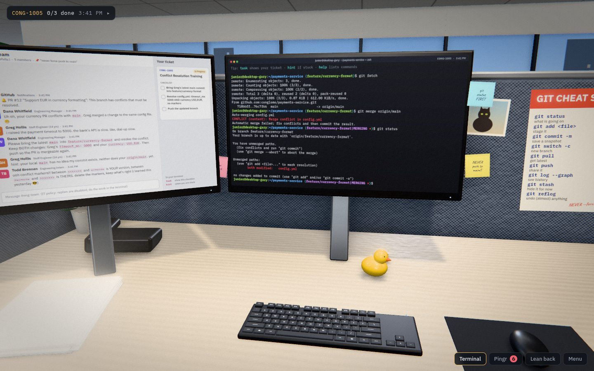
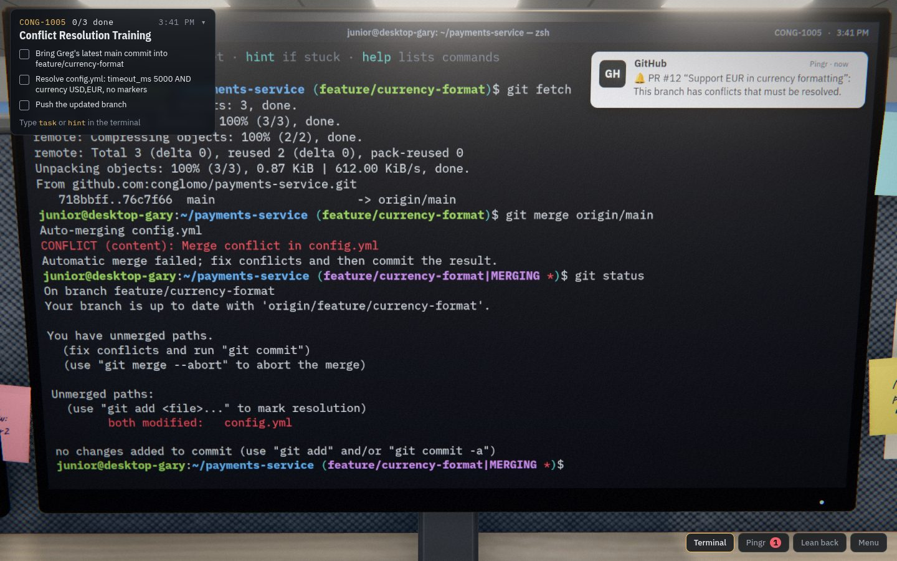
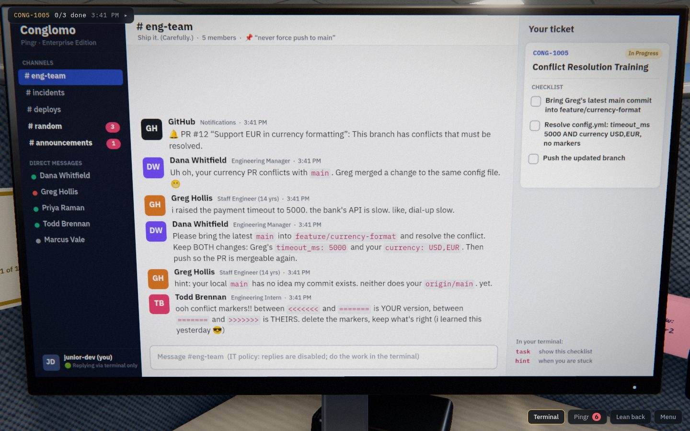
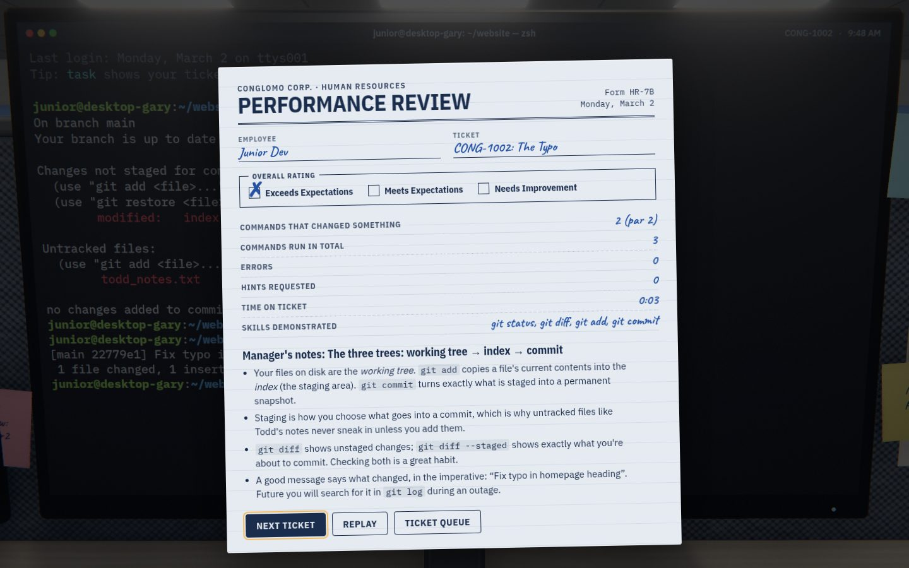

# GitGud

A first-person junior developer simulator that teaches git.

You sit at a desk at Conglomo Corp. Your manager, a sarcastic staff engineer, an
on-call SRE and an intern who force-pushes things message you on Pingr, the
company chat. You do the work in a real-feeling terminal. Type the right commands and
the repo survives; type the wrong ones and you get an incident report.



| Terminal | Pingr | Performance review |
| --- | --- | --- |
|  |  |  |

## Play

```bash
npm install
npm run dev        # http://localhost:5173
```

- Type into the terminal. Everything is simulated in the browser: no real git, no real network.
- `task` shows your ticket, `hint` gives a nudge (it's noted in your performance review), `help` lists commands.
- Move the mouse to the left edge (or press **F2**) to look at Pingr. **F3** leans back. **Esc** opens the menu.
- Settings has Low / Medium / High graphics and a **Flat 2D** mode that skips the 3D office.

A physical keyboard is strongly recommended. Vim is not installed. (There was an incident.)

## The week

| Ticket | Title | You learn |
| --- | --- | --- |
| CONG-1001 | Hello, World (Again) | `git config`, `git clone`, `cd` |
| CONG-1002 | The Typo | `status`, `diff`, staging one file, commit messages |
| CONG-1003 | Branch Out | `switch -c`, `push -u`, upstreams, protected branches |
| CONG-1004 | Request for Pull | `gh pr create`, linking issues, squash merge, cleanup |
| CONG-1005 | Conflict Resolution Training | `fetch`, `merge`, resolving conflict markers in nano |
| CONG-1006 | Drop Everything | `stash -u`, hotfixing main, `stash pop` |
| CONG-1007 | Undo! Undo! | `revert` vs `reset` on shared history |
| CONG-1008 | Patch Tuesday | `cherry-pick`, release branches, annotated tags |
| CONG-1009 | Keep It Linear | `rebase`, conflicts mid-rebase, `--force-with-lease` |
| CONG-1010 | Make It Look Intentional | `rebase -i` / `reset --soft` squashing |
| CONG-1011 | The Intern Force-Pushed | `reflog`, recovering "lost" commits |
| CONG-1012 | Loose Lips Sink Ships | `rm --cached`, `.gitignore`, `commit --amend` |
| CONG-1013 | Who Broke the Build? | `bisect` (and `bisect run`), `gh issue comment` |
| CONG-1014 | Friday, 4:47 PM | all of it, on the intern's laptop |

Every ticket ends with a Performance Review whose "Manager's notes" explain *why* the
commands work, not just which ones to type.

## How it's built

TypeScript + Vite + Three.js, no backend. Four layers, each usable without the one above it:

```
src/engine   a git implementation (objects, refs, index, merge, rebase, remotes, "GitHub")
src/shell    a small zsh: quoting, pipes, redirection, a virtual filesystem, gh, nano
src/game     levels as data + a Director that runs them (IMs, objectives, incidents)
src/render   the Three.js office;  src/ui  terminal/chat canvases, HUD, menus;  src/audio
```

[docs/DESIGN.md](docs/DESIGN.md) walks through the architecture and the reasoning behind
it: how the git model works, how fidelity against real git is tested, how a level is
put together, and how the screens end up on 3D monitors.

## Development

```bash
npm run check        # typecheck + unit/level tests (vitest)
npm run crosscheck   # run scenarios through real git AND the simulator, diff the output
npm run smoke        # build, play levels 1-2 in headless Chromium, save screenshots
npm run shots        # targeted screenshots (see scripts/shots.ts)
npm run build:artifact  # single self-contained HTML file in dist-artifact/
```

The browser scripts need a Chromium binary (`CHROMIUM_PATH`, default `/opt/pw-browsers/chromium`).

### Adding a level

1. Copy a file in `src/game/levels/` (e.g. `07-revert.ts`) and edit it: `setup` builds the
   repos with the same engine the player uses, `objectives` are predicates over a `Probe`,
   `reactions` make coworkers comment on what the player did, `fails` end the ticket.
2. Give it a `solution` (the commands that win) and list it in `src/game/levels/index.ts`.
3. `npm test`: the level tests fail unless the level starts unsolved and the solution solves it.
   Add alternative solutions and failure paths in `tests/game/levels.test.ts`.

### Deploying

The build is a static site (`npm run build` produces `dist/`). A manual GitHub Pages
workflow lives in `.github/workflows/pages.yml`: enable Pages (source: GitHub Actions)
in the repository settings, then run the workflow from the Actions tab.
