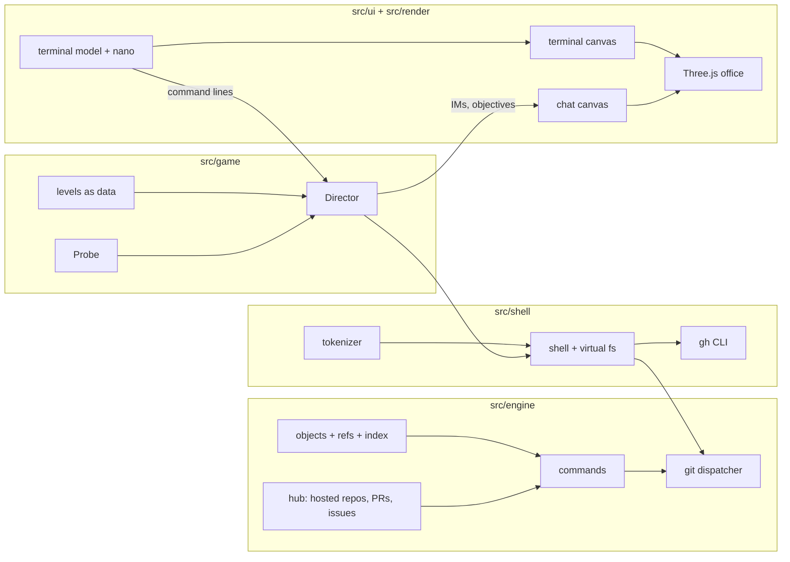

# GitGud: design notes

This document explains how GitGud is put together and why, in the order the pieces
depend on each other: the git engine first, then the shell on top of it, then the game
rules, and finally the screens and the 3D office.

## 1. Why write a git engine at all?

The obvious alternatives were to run real git (for example compiled to WebAssembly) or to
wrap a library like isomorphic-git. Both were rejected for the same reasons:

- **The game needs to see inside.** Objectives ask questions like "is Greg's commit an
  ancestor of your branch?" or "does any unpushed commit contain `.env`?". With our own
  engine those are one-line queries (`src/game/probe.ts`).
- **The game needs to hear what happened.** Every command emits events (`world.emit`)
  such as `push { forced: true }` or `rebase { stage: 'conflict' }`, which drive the
  coworkers' reactions and the fail conditions.
- **Determinism.** Levels build history with a controlled clock, so tests are exactly
  reproducible.
- **A fake GitHub.** Protected branches, pull requests, reviews and issues are not git
  features. They live on the server, so we need a server anyway (`src/engine/hub.ts`).

The cost is fidelity risk: a teaching game must not teach wrong behaviour. Section 3 is
about how that risk is managed.

## 2. How the engine models git

Git is surprisingly small at its core, and the engine mirrors that core directly.

**Objects** (`objects.ts`). Everything is an immutable object identified by the SHA-1 of
its contents: *blobs* (file contents), *trees* (directory listings), *commits* (a tree +
parent commit hashes + author + message) and *tags*. Change one byte of history and every
descendant hash changes. That's why "rewriting history" is a real, visible thing.

One deliberate simplification: **trees are flat**. A tree maps full paths like
`src/app.js` straight to blob hashes instead of nesting sub-trees. Players never observe
the difference, and it makes diffing and merging much simpler.

**Refs and HEAD** (`repo.ts`). A branch is just a name that points at a commit hash
(`refs/heads/main`). HEAD points at a branch (or directly at a commit: "detached HEAD").
Committing creates a commit whose parent is HEAD and then moves the branch. Remote-tracking
branches (`refs/remotes/origin/main`) are your *local memory* of where the server's
branches were at your last fetch, and `origin/HEAD` is a symbolic ref.

**The three trees.** The repository holds three snapshots: HEAD (last commit), the index
(staging area), and the working tree (files). `git status` is literally a diff between
those three (`Repository.status()`), and most commands are defined in terms of which of
the three they change:

| command | HEAD/branch | index | working tree |
| --- | --- | --- | --- |
| `add` | | ✓ | |
| `commit` | ✓ | | |
| `reset --soft` | ✓ | | |
| `reset` (mixed) | ✓ | ✓ | |
| `reset --hard` | ✓ | ✓ | ✓ |
| `restore <file>` | | | ✓ |
| `restore --staged` | | ✓ | |

**Reflogs.** Every time a ref moves, an entry is appended to that ref's reflog (and HEAD's).
That is what makes level 11 (recovering force-pushed commits) possible, and it's the same
mechanism real git uses.

**Diff and merge** (`diff.ts`). Diffs use Myers' O(ND) algorithm (git's default). Merges
use *diff3*: compare "ours" and "theirs" to their common ancestor; regions changed on only
one side are taken automatically, regions changed on both become conflict markers. Tree
merges (`mergeTrees` in `commands/merging.ts`) add file-level cases (modify/delete, add/add)
on top.

Once three-way merge exists, a lot of git falls out of it:

- **merge** = merge-base + three-way merge (or just move the pointer: fast-forward).
- **cherry-pick C** = three-way merge with base = C's parent, theirs = C.
- **revert C** = the same with base and theirs swapped.
- **rebase** = a to-do list of cherry-picks replayed onto a new base, then the branch is
  moved (`runRebase`). Interactive rebase edits that list in nano.
- **stash** = a commit whose tree is your working directory, with the index as a second
  parent (exactly how git stores it), applied back with a three-way merge.

**Remotes** (`commands/remote.ts`, `hosted.ts`). A hosted repo is a bare repository:
objects and refs, no working tree. `fetch` copies the objects you're missing and moves your
remote-tracking refs; `push` does the reverse and is rejected unless it's a fast-forward
(or forced). Branch protection, `Fixes #N` auto-closing and PR merges happen server-side.

## 3. Fidelity: testing against real git

`scripts/crosscheck.ts` runs the same scenario through **real git** in a temp directory and
through the simulator, normalizes things that legitimately differ (hashes, dates, paths)
and prints a line diff. It covers basics, branching, conflicts, rebase, reset/reflog,
stash, cherry-pick/revert, detached HEAD, error messages, and a full remote workflow with
a coworker pushing concurrently.

It found real bugs during development: `git status` puts blank lines *after* sections,
`switch` reported phantom changes, `origin/HEAD` must be symbolic, `git pull` only prints
`* branch ... -> FETCH_HEAD` when you name the branch, and more. The remaining differences
are intentional:

- Decorations like `(HEAD -> main)` are always shown, because the game's terminal is a
  TTY (git hides them when piped).
- Progress lines that real git redraws with carriage returns aren't printed.
- Commit hashes differ (flat trees, synthetic timestamps).

Known simplifications: no `add -p`, no nested repos or submodules, no octopus merges,
rename detection only for identical content, `merge`/`revert` don't open the editor by
default, and `merge --abort` restores only the paths the merge touched.

## 4. The shell

The player types into a small zsh-like shell (`src/shell`), not into git directly, because
real work mixes git with `ls`, `cat`, `echo "x" >> .gitignore` and editors.

- `tokenize.ts` handles quotes, escapes, `&&`, `||`, `;`, pipes, `>`/`>>`.
- `fs.ts` is a virtual filesystem: `~` holds project folders, and each project's files
  are its repository's working tree, so editing a file really does make it "modified".
- Output travels as ANSI color codes (like real git). Piping or redirecting strips them,
  which is exactly what git does when stdout isn't a terminal.
- `gh.ts` simulates the GitHub CLI for pull requests and issues.
- Editors are a callback: `nano file` or `git commit` without `-m` awaits the UI's nano
  and gets back the saved text, the same contract as `$EDITOR` in real git.

## 5. The game layer

**Levels are data** (`src/game/levels/*.ts`). A level has a `setup` (which builds repos
by running real engine commands, silently), intro messages, objectives, hints, reactions,
fail rules, outro messages, a debrief, and a scripted `solution`.

**Objectives are predicates over state, not over commands.** "Keep todd_notes.txt out of
the commit" checks the HEAD tree, not whether you typed `git add index.html`. So any
valid approach wins: `commit --amend`, `reset --soft`, cherry-picking by hash or by branch
name. The level tests prove this with alternative solutions.

**The Director** (`director.ts`) runs a level:

1. Build a fresh `World` and apply the level's setup.
2. Deliver IMs on a schedule, with "typing…" time proportional to length.
3. After each command: collect the events it emitted, check fail rules (an incident ends
   the ticket), fire reactions (Greg noticing your force push), re-evaluate objectives.
4. When every objective holds at once: coworkers wrap up, then the performance review.

The rating counts only commands that *change* something against the level's par, so
running `git status` and `git log` a lot never hurts you. Exploration is a good habit.

## 6. Screens and the office

**Screens are canvases.** The terminal and Pingr are drawn with the 2D canvas API
(`src/ui/screens`) and used as emissive textures on the 3D monitors. Redrawing a
1920×1080 canvas means re-uploading it to the GPU, so each screen redraws only when
something changed (a version counter on the model, the cursor blink, toasts).

**The terminal model is separate from its renderer** (`terminal-model.ts`, `nano.ts`),
so the same state could drive a DOM terminal, a canvas, or tests.

**Why the office looks the way it does** (`src/render`):

- *Physically based materials* with bevelled edges (RoundedBoxGeometry). Bevels catch
  highlights, which reads as "manufactured object" instead of "CG box".
- *Procedural textures* (`textures.ts`): laminate, fabric, carpet, ceiling tiles, sticky
  notes and a skyline are generated at startup. No asset downloads.
- *Light from the screens*: rectangular area lights at each monitor spill blue-white light
  onto the keyboard and desk, the single biggest "you're really sitting here" cue.
- *Time of day*: each level's clock sets the sky, window light, and after-hours lighting.
- *Post-processing*: MSAA, ground-truth ambient occlusion, subtle bloom, film grain and
  vignette. Neutral tone mapping keeps screen colors accurate so the text stays crisp.
- The camera fits each monitor to the viewport and follows the mouse a little ("head
  follows gaze"), and the keyboard's keycaps physically depress as you type.

**Getting closer to photoreal.** The biggest remaining gap is assets, not code. The
natural next steps are CC0 scanned models and textures (e.g. from Poly Haven) loaded as
glTF, a real HDRI environment map, baked lightmaps for the static room, and hands on the
keyboard. `buildOffice()` is the single place to swap procedural meshes for loaded ones.

## 7. Testing strategy

| Layer | How |
| --- | --- |
| diff/merge/SHA-1 | unit tests, SHA-1 checked against Node's crypto |
| git commands | scenario tests (`tests/engine`) + `crosscheck` against real git |
| levels | every level starts unsolved and its solution solves it; alternative solutions; failure paths trigger the right incident |
| browser | `smoke.ts` plays levels 1–2 in headless Chromium; `shots.ts` / `ui-check.ts` for visuals, phone layout and overflow |

## 8. Known limitations and ideas

- Phones render the game, but it's designed for a physical keyboard and a wide screen.
- The terminal has no mouse text selection.
- More levels: `git worktree`, submodules, `git blame` detective work, a merge-queue
  outage, a sprint of back-to-back tickets with a real clock.
- A sandbox mode (free play in a repo with a live `git log --graph` panel on the second
  monitor) would make a great learning tool on its own.
